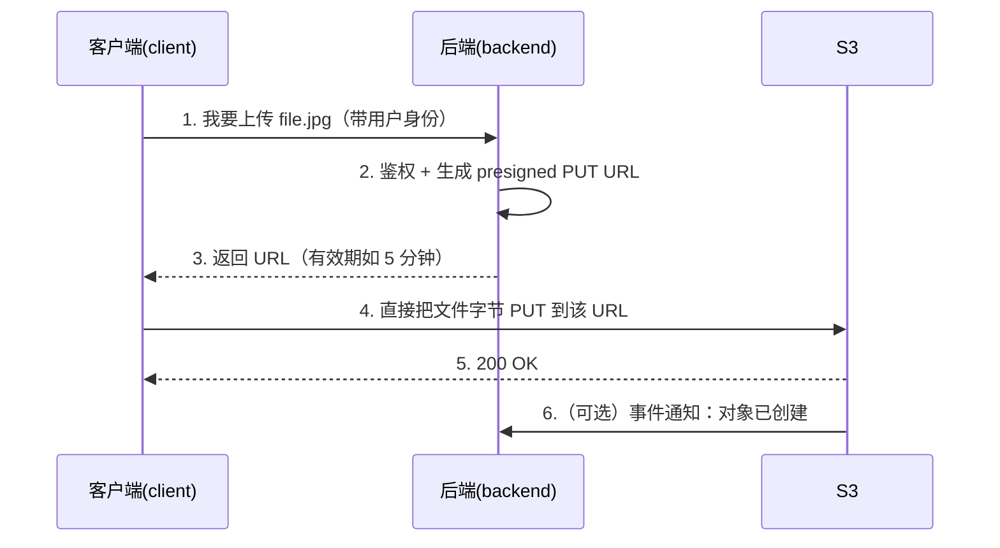
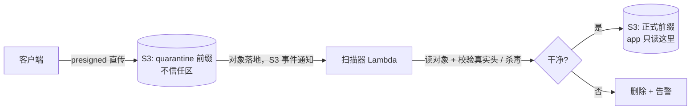
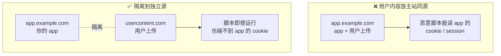

---
tags:
  - aws
  - s3
---

# S3 · Intro

S3（Simple Storage Service，简单存储服务）是 AWS 最核心的服务之一：一个近乎无限容量、高持久性(durability)的**对象存储(object storage)**。下面由浅入深。

## 1. S3 是什么

S3 是**对象存储**，不是文件系统(file system)，也不是块存储(block storage)。你往里面存的是一个个**对象(object)**，每个对象 = 数据本体(bytes) + 元数据(metadata) + 一个唯一的**键(key)**。

- **对象存储 vs 文件系统**：没有真正的「目录树」，是一个**扁平命名空间(flat namespace)**。你看到的「文件夹」其实是键里的**前缀(prefix)**模拟出来的（`photos/2026/a.jpg` 只是一个完整的 key，斜杠没有特殊含义）。
- **不能原地改**：对象是**整存整取(immutable)**的——「修改」实际是用同名 key 覆盖(overwrite)整个对象，不能像文件那样 seek 到中间改几个字节。
- **特点**：容量近乎无限、单对象最大 5 TB、超高持久性（官方宣称 11 个 9，即 99.999999999%）、高可用、按用量付费(pay-as-you-go)。数据存在某个**区域(region)**里。

## 2. 三个核心概念：bucket / object / key

| 概念 | 中文 | 说明 |
| --- | --- | --- |
| **bucket** | 桶 | 对象的顶层容器，名字**全局唯一(globally unique)**，归属某个 region |
| **object** | 对象 | 存进去的「文件」，含数据 + 元数据 + 版本等 |
| **key** | 键 | 对象在桶内的唯一标识，形如 `photos/2026/a.jpg` |

一个对象的访问路径大致是：

```text
https://<bucket>.s3.<region>.amazonaws.com/<key>
                                            └── 例如 photos/2026/a.jpg
```

!!! note "「文件夹」是个错觉"
    列举(list)对象时用 `prefix=photos/2026/` + `delimiter=/` 就能模拟「列出某个文件夹」。但底层没有目录，只有按 key 字典序排列的扁平对象。

## 3. 常用功能

| 功能 | 中文 | 一句话用途 |
| --- | --- | --- |
| Storage Classes | 存储类别 | Standard / Standard-IA / Glacier 等，用**访问频率**换**成本** |
| Lifecycle Rules | 生命周期规则 | 自动把旧对象转冷存储、或到期删除 |
| Versioning | 版本控制 | 保留历史版本，防误删/误覆盖 |
| Encryption | 加密 | 静态加密(SSE-S3/SSE-KMS) + 传输加密(TLS) |
| Access Control | 访问控制 | IAM 策略 + 桶策略(bucket policy) + Block Public Access，**默认私有** |
| Presigned URL | 预签名 URL | 给客户端临时、限定的直传/直下权限（见 §4） |
| Multipart Upload | 分片上传 | 大文件分块并行上传，可断点续传 |
| Event Notification | 事件通知 | 对象创建/删除时触发 Lambda / SQS / SNS |
| Static Hosting | 静态网站托管 | 直接把桶当静态网站 |
| Replication / CloudFront | 复制 / CDN | 跨区域复制、或前面挂 CDN 加速分发 |

最常用、也最该先掌握的是 **存储类别 + 生命周期 + 版本控制 + 访问控制 + 预签名 URL** 这几样。

## 4. 后端 / 客户端到底怎么和 S3 交互？

先回答你的核心问题：**不是「都通过 presigned URL」**。presigned URL 只是**最常见**的一种（尤其是浏览器/手机端直传直下），但一共有三种主流模式，按场景选。

> 底层统一认知：S3 就是一套 **HTTPS REST API**。每个操作（PUT 对象、GET 对象、List…）都是一个用 AWS 凭证(credentials)做了 **签名(SigV4)** 的 HTTPS 请求。boto3 / AWS SDK 只是帮你封装签名和请求而已。

### 模式 A：后端代理 / 中转（backend proxy）

客户端 → **你的后端** → S3。后端持有 AWS 凭证，用 SDK 读写 S3，客户端**从不直接碰 S3**。

- ✅ 适合：小文件、需要服务端校验/转码/打水印、要隐藏桶结构。
- ❌ 缺点：**数据流经你的服务器**，占带宽和 CPU，大文件不划算（等于传两遍）。

### 模式 B：预签名 URL（presigned URL）—— 最常见

后端用自己的凭证**签出一个有时效的 URL**，把这个 URL 给客户端；客户端拿着它**直接**和 S3 通信（直传或直下），后端**不在数据通路上**。

- 这个 URL 只授权**一个特定操作（PUT 或 GET）+ 一个特定 key + N 秒后过期**。
- 客户端只是对这个 URL 发普通的 HTTP `PUT`/`GET`，**身上不需要任何 AWS 凭证**。
- ✅ 适合：浏览器/App 直传直下、大文件，省后端带宽、易扩展、安全（凭证不下发、权限受限且会过期）。
- ❌ 限制：一个 URL 只对应一个对象/操作；想限制大小/类型要用 **presigned POST**（见下）。

**上传时序（presigned PUT）：**



下载同理：客户端先找后端要一个 presigned **GET** URL，再直接从 S3 下载。

### 模式 C：客户端用临时凭证（STS / Cognito）

客户端通过 **Cognito Identity Pool** 或 **STS AssumeRole** 拿到一份**临时 AWS 凭证(temporary credentials)**，然后直接用 AWS SDK 操作 S3。

- ✅ 适合：手机/桌面 App 要做**很多次、很灵活**的 S3 操作（一个个签 URL 太麻烦）。
- ❌ 缺点：接入更复杂，权限要靠 IAM 角色(role)严格限定。

### 那「下载」一定要 presigned 吗？

不一定：

- **私有对象**：要 presigned GET（或模式 A/C），否则没权限。
- **公开内容**（图片、前端静态资源）：直接用**公开 URL** 或挂 **CloudFront(CDN)** 分发即可，**根本不用签名**。

### 模式怎么选（速查）

| 场景 | 推荐模式 |
| --- | --- |
| 小文件、需服务端校验/处理 | A 后端代理 |
| 浏览器/App 直传大文件、偶尔下载 | **B 预签名 URL** |
| App 频繁、多样地读写 S3 | C 临时凭证(Cognito/STS) |
| 公开可访问的静态资源 | 公开 URL / CloudFront |

## 5. 代码示例（boto3）

**生成预签名 URL（下载 GET / 上传 PUT）：**

```python
import boto3

s3 = boto3.client("s3")

# 下载：给客户端一个 1 小时内有效的 GET URL
get_url = s3.generate_presigned_url(
    "get_object",
    Params={"Bucket": "my-bucket", "Key": "photos/2026/a.jpg"},
    ExpiresIn=3600,                       # 秒
)

# 上传：给客户端一个 5 分钟内有效的 PUT URL
put_url = s3.generate_presigned_url(
    "put_object",
    Params={"Bucket": "my-bucket", "Key": "uploads/a.jpg"},
    ExpiresIn=300,
)
# 客户端随后：HTTP PUT 文件字节到 put_url 即可，无需 AWS 凭证
```

!!! warning "裸 presigned PUT 不限制内容和大小"
    这个 PUT URL 只锁定「key + 操作 + 过期时间」，**不限制文件类型、大小、真实内容** —— 客户端能往这个 key 传任意字节、甚至超大文件。怎么设防见 [§6 上传与分发安全](#upload-security)。

!!! tip "生成 presigned URL 是纯本地操作"
    `generate_presigned_url` **不会**访问网络——它只是用你的密钥在本地做一次签名计算。所以即使桶里还没有这个对象，也能先把上传 URL 签出来。

**presigned POST（浏览器表单直传，可加约束）：** 比 PUT 多了能限制**大小/类型/key 前缀**的能力：

```python
post = s3.generate_presigned_post(
    Bucket="my-bucket",
    Key="uploads/${filename}",
    Fields={"Content-Type": "image/jpeg"},
    Conditions=[
        {"Content-Type": "image/jpeg"},
        ["content-length-range", 0, 5 * 1024 * 1024],   # 最大 5 MB
    ],
    ExpiresIn=300,
)
# 返回 post["url"] 和 post["fields"]，浏览器用 multipart/form-data 提交
```

## 6. 上传与分发安全 {#upload-security}

presigned URL 很方便，但「裸的 presigned PUT」约束很弱，必须主动加防护。这一节回答两个实战问题：**怎么防用户传危险/超大文件**、**怎么安全地把内容发回去**。

### presigned PUT 默认只锁「三样」

| presigned PUT 能锁              | 默认**不**锁                     |
| ------------------------------- | -------------------------------- |
| 哪个 key、哪个操作(PUT)、多久过期 | 文件**类型**、文件**大小**、真实**内容** |

签了 `uploads/a.jpg`，客户端照样能往这个 key 传任意字节、甚至几个 GB —— key 里的 `.jpg` 只是字符串，S3 不校验内容。

### 限制大小 / 类型 / 路径：presigned POST + Conditions（S3 强制）

要在**上传那一刻**就拦住，用上面 §5 的 presigned **POST** + `Conditions`，由 **S3 直接强制**：

- `["content-length-range", 0, 5*1024*1024]` —— 大小**硬上限**，超了 S3 直接拒绝，文件根本进不来。← 解决「超大文件」
- `["starts-with", "$Content-Type", "image/"]` —— 限制声明的类型(content type)。
- `["starts-with", "$key", "uploads/user123/"]` —— 限制只能写到某个前缀(prefix)。

!!! danger "Content-Type 只校验「声明」，不校验「真实字节」"
    上面的类型条件只检查客户端**声明**的 HTTP 头，**不看文件真实内容**。一个恶意脚本完全可以声明成 `image/jpeg` 传上来。所以「类型 / 恶意」检查**必须在服务端对字节本身做**（见下）。

### 防危险文件：隔离区(quarantine) → 扫描 → 放行

注意顺序：文件是**先直传进 S3 的一块「不信任区」，落地后再扫描**，不是「扫完才进 S3」：



- **quarantine 本身就是 S3 里的一个桶/前缀**（如 `quarantine/`），客户端照常用 presigned URL 直传进去 —— 保留「不经过后端」的好处。
- **扫描器通常是个 Lambda 函数**（不是常驻服务），由 S3 **事件通知(event notification)** 触发；它校验**真实文件头(magic bytes)**、跑杀毒（AWS 托管的 **GuardDuty Malware Protection for S3**，或自建 ClamAV）。
- 通过 → **S3 内部 copy** 到 app 真正读取的正式前缀；不通过 → 删除。整个「搬运」是 S3 到 S3，不是客户端重传。

### 「Block Public Access」≠ 谁都不能访问

常见误解：开了 **Block Public Access**，用户是不是就传不了、下不了了？**不会**。关键是区分两种访问：

| 访问类型             | 谁能访问            | 例子                              |
| -------------------- | ------------------- | --------------------------------- |
| 公开访问(public)     | 任何人，**无需凭证** | 公开桶 / 裸公开 URL               |
| 授权访问(authorized) | 特定的人，**带签名/权限** | **presigned URL**、带凭证 SDK、CloudFront |

**Block Public Access 只挡「匿名公开」那种**。presigned URL 自带签名(signature) = 临时授权，属于「授权访问」，**即使 Block Public Access 开着也照常能传/下**。

> 比方：大楼**不对路人开放**（Block Public Access），但你照样能给访客发一张**限时门禁卡**（presigned URL）。两者不矛盾，而且正是推荐姿势。

### 安全地「分发」用户内容

文件存下来不危险，**把它当网页发回去**才危险：恶意 HTML/JS 在受害者浏览器里执行 → **XSS(跨站脚本)**。两层防护：

**① 让浏览器别把它当网页执行** —— 下发（presigned GET）时设响应头(response header)：

```python
url = s3.generate_presigned_url(
    "get_object",
    Params={
        "Bucket": "my-bucket", "Key": "uploads/user123/x.bin",
        "ResponseContentType": "application/octet-stream",          # 别当网页渲染
        "ResponseContentDisposition": 'attachment; filename="x"',   # 强制下载而非内联
    },
    ExpiresIn=300,
)
```

- `Content-Type` 设成非 `text/html`（再配 `X-Content-Type-Options: nosniff`）→ 浏览器不把它当页面执行。
- `Content-Disposition: attachment` → 当附件**下载**，而不是在标签页里打开运行。

**② 用独立域名隔离（同源策略 same-origin policy）** —— 浏览器按**源(origin = 协议+域名+端口)**划信任边界，同源内容能读彼此的 cookie / session：



把用户内容放在**独立域名**（如 GitHub 的 `raw.githubusercontent.com`、Google 的 `*.googleusercontent.com`），即使出事也波及不到主站的 cookie / session。

### 安全清单

- [ ] **默认私有**：保持 **Block Public Access** 开启；要公开优先用 CloudFront，而不是把桶设公开。
- [ ] **最小权限(least privilege)**：后端 / 角色只授予所需的桶和操作。
- [ ] **限大小 / 类型 / 路径**：用 presigned POST 的 `Conditions`（`content-length-range` 是硬限制）。
- [ ] **危险内容服务端扫描**：隔离区 + 事件触发 Lambda / GuardDuty，校验真实字节后再放行。
- [ ] **安全分发**：设对 `Content-Type` / `Content-Disposition`，用户内容放独立域名。
- [ ] **presigned URL 短命** + **全程 TLS**。

## 小结

- S3 = 桶(bucket) + 对象(object) + 键(key) 的扁平对象存储，默认私有、高持久。
- 和 S3 交互有三种模式：**后端代理 / 预签名 URL / 临时凭证**；presigned URL 是直传直下最常用的一种，但**不是唯一**，公开内容甚至不用签名。
- 记住一句：**presigned URL = 后端用自己的凭证，签一张「限时 + 限操作 + 限对象」的通行证给客户端，让它绕过后端直接和 S3 打交道。**
- **上传/分发安全**：裸 presigned PUT 不限大小/内容；用 presigned POST 的 `content-length-range` 限大小，危险内容靠服务端扫描，分发用 `Content-Disposition` + 独立域名。见 [§6](#upload-security)。
