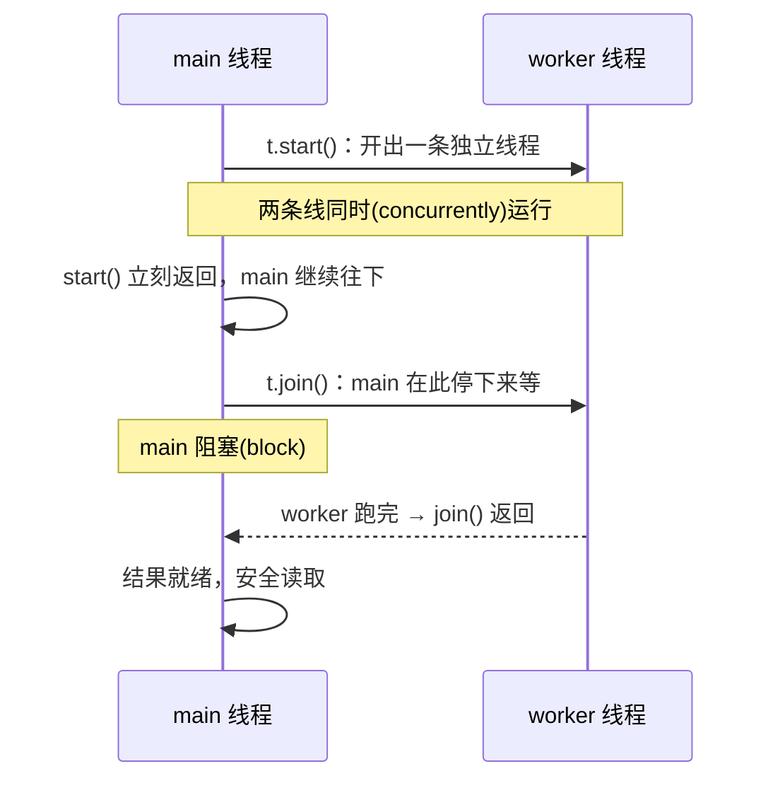
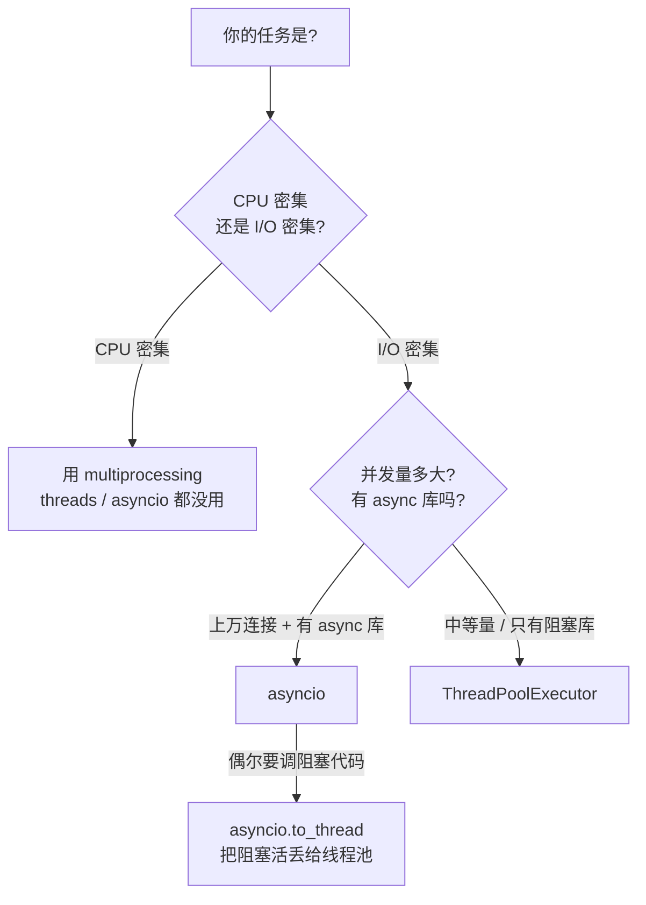

---
tags:
  - python
  - concurrency
---

# Threads vs Asyncio

承接 [Concurrency · Intro](concurrency-01-intro.md)：上一篇讲的是「多个执行流(execution flow)交错」带来的正确性问题和同步工具。这一篇聚焦 Python 里实现并发(concurrency)的两条主流路线 —— **线程(threads)** 和 **asyncio** —— 它们解决的是同一类问题(让 I/O 等待重叠起来)，但调度(scheduling)方式截然不同。

## 一句话总览

|                  | threads                       | asyncio                          |
| ---------------- | ----------------------------- | -------------------------------- |
| 谁来切换         | 操作系统**抢占式（Preemptive）**(随时可切)  | 事件循环**协作式（cooperative）**(只在 `await` 处切) |
| 用几个线程       | 多个 OS 线程                  | **单**线程                        |
| 能并行跑 Python? | 不能(受 GIL 限制)             | 不能(本来就单线程)               |

两者都**不能让 Python 字节码(bytecode)真正并行(parallelism)** —— 那是 `multiprocessing` 的活。它们的价值在于:**当任务在等 I/O 时，把等待的时间重叠起来**。下面由浅入深。

---

## 1. Threads：基本用法

最底层是 `threading.Thread`：手动创建、`start()` 启动、`join()` 等它结束。

```python
import threading

def worker(name):
    print(f"hello from {name}")

t = threading.Thread(target=worker, args=("t1",))
t.start()   # 新线程开始跑 worker
t.join()    # 主线程在这里等 t 结束
```

### 深入理解 start() 与 join()

把多线程想成两条平行的**时间线(timeline)**：一条是**主线程(main thread)**，一条是你新建的**子线程(worker thread)**。



- **`t = Thread(target=...)`**：只是**创建**线程对象，**还没跑**。
- **`t.start()`**：**点火**。操作系统(OS)开出一条**独立的**线程，worker 自己开始跑；`start()` **立刻返回**，main **不等**，继续执行下一行 —— 此刻两条线在**同时**跑。
- **`t.join()`**：让**调用者(main)阻塞(block)**，一直等到 worker 结束才往下走。

!!! tip "纠正一个常见误解：join 不是「把任务加进主线程」"
    一个很常见的错误直觉是：「程序只有一条主线程，别的活儿要**加到主线程上**排队才能跑」。

    那其实是 **asyncio 的事件循环(event loop)** 模型 —— 单线程，所有协程(coroutine)被调度到这一条线程上轮流跑。**`threading` 不是这样**：`start()` 之后，worker 是一条**真实、独立的 OS 线程**，自己就在跑，**不需要** main 去「添加」或「调度」它。

    所以 `join()` **不会**把 worker「并入」main、也不会让 worker 才开始跑。worker 一直独立运行；`join()` 唯一做的事是：**让 main 停下来等它**。

#### 为什么需要 join：保证「结果就绪」的时机

worker 的结果是它**自己写入**的（下例里算完写 `42`）。问题在于 main **不知道它何时算完** —— 你在 `join` 的哪一边读结果，决定了你读到什么：

```python
box = {}                         # worker 算完往这里写结果

# A：在 join 之前读 → worker 可能还没算完
t.start()
print(box.get("result"))         # None ← worker 还在跑
t.join()

# B：join 之后读 → worker 一定已结束
t.start()
t.join()                         # 先在这里等 worker 干完
print(box.get("result"))         # 42
```

可运行脚本 [`concurrency-02-start-join.py`](https://github.com/Alex2Yang97/cs-learning-wiki/blob/main/scripts/python-fundamentals/concurrency-02-start-join.py) 用时间戳(timestamp)把这点摆出来：

```
A. 不等就读  -> box.get('result') = None   ← worker 还没算完
B. 先 join   -> box.get('result') = 42      ← join 之后，保证就绪
```

> 关键：差别**不在于有没有 join**，而在于你把 `join()`（等待）放在了「用结果」的**前面还是后面**。放前面才有意义。

#### 不 join 行不行？能，但你在「赌时间」

worker 既然是独立跑的，那**不 join、只要读的时候它恰好已经结束，也能看到结果**。脚本 [`concurrency-02-no-join.py`](https://github.com/Alex2Yang97/cs-learning-wiki/blob/main/scripts/python-fundamentals/concurrency-02-no-join.py) 全程不调用 `join()`：

```
[0.0s] 刚 start，立刻读 -> None     ← 还没跑完
[3.0s] 等 3 秒后再读   -> 42        ← 没 join，照样看到了
```

但「等 3 秒」是在**赌(race)** worker 3 秒内能跑完 —— 你通常根本不知道它要多久（网络快慢、数据多少都在变）。`join()` 就是把「碰运气」变成「有保证」：

| 等待方式                 | 能拿到结果吗 | 问题                              |
| ------------------------ | ------------ | --------------------------------- |
| 不等，立刻读             | ❌ 常常 None | 没给 worker 时间                  |
| `sleep(固定秒数)` 再读   | ⚠️ 看运气    | 在赌时间，赌少了 None、赌多了浪费 |
| **`join()` 再读**        | ✅ 一定      | 精确等到结束，**正解**            |

#### 多线程：先全 start，再全 join

线程一多，`start` / `join` 的**循环顺序**会直接决定你是并发还是串行：

```python
for t in threads: t.start()    # ✅ 先全部点火 → 它们并发(concurrent)地跑
for t in threads: t.join()     # 再逐个等它们结束

for t in threads:
    t.start(); t.join()        # ❌ 启一个等一个 → 退化成串行(serial)
```

实测（见上面脚本的场景 C）：3 个各睡 1 秒的线程，先全 `start` 再全 `join` 总耗时 ≈ **1s**；而 `start` 完立刻 `join` ≈ **3s**。

### 实战：用线程池 ThreadPoolExecutor

实战中**几乎总是用更高层的线程池(thread pool)`ThreadPoolExecutor`**：它管理一个线程池，自动复用线程、收集返回值、传播异常 —— 它内部就帮你 `join`，还能用 `future.result()` 直接取回返回值（`result()` 会自动等到那个任务结束）。

```python
from concurrent.futures import ThreadPoolExecutor
import requests  # 一个「阻塞式(blocking)」的库

urls = ["https://example.com"] * 10

with ThreadPoolExecutor(max_workers=10) as pool:
    # map 会把 10 个请求分发到线程池里并发执行
    results = list(pool.map(requests.get, urls))
```

!!! info "为什么线程对 I/O 有效，对 CPU 无效"
    Python 有 **GIL(全局解释器锁，Global Interpreter Lock)**：同一时刻只有一个线程能执行 Python 字节码。

    - **I/O 密集型(I/O-bound)**(等网络/磁盘)：线程在阻塞等待时会**释放 GIL**，于是 10 个线程的「等待」可以重叠 → 有效加速。
    - **CPU 密集型(CPU-bound)**(纯计算)：线程一直握着 GIL 算，根本没有重叠的机会 → 多线程**几乎不加速**(还多了切换开销)。CPU 密集要用多进程(`multiprocessing`)。

## 2. Asyncio：基本用法

asyncio 是**单线程**的。用 `async def` 定义协程(coroutine)，用 `await` 在「要等待的地方」**主动让出(yield)**控制权，事件循环(event loop)趁机去跑别的协程。

```python
import asyncio

async def fetch(i):
    print(f"start {i}")
    await asyncio.sleep(1)   # 让出事件循环：这 1 秒里 loop 去跑别的协程
    print(f"done {i}")
    return i

async def main():
    # gather 把多个协程并发跑起来，一起 await
    results = await asyncio.gather(*(fetch(i) for i in range(10)))
    return results

asyncio.run(main())   # 程序入口：建立事件循环并跑 main()
```

三个关键词:

- **协程(coroutine)**：`async def` 定义的函数,调用它**不会立刻执行**,而是返回一个待调度的协程对象。
- **`await`**：唯一的「让出点(yield point)」。只有在 `await` 处,事件循环才可能切到别的协程。
- **事件循环(event loop)**：单线程里的调度器(scheduler),在一堆协程的 `await` 之间来回切换。

!!! warning "asyncio 需要 async 生态"
    `await` 只能等「可等待对象(awaitable)」。要真正并发,你调用的库本身必须是 async 的:用 `aiohttp` 而不是 `requests`,`asyncpg` 而不是普通 `psycopg2`。把一个**阻塞(blocking)**库塞进协程里 = 灾难(见 [常见坑](#pitfalls))。

## 3. 它们到底差在哪

### 抢占式(preemptive) vs 协作式(cooperative) —— 最核心

- **threads = 抢占式(preemptive)**：操作系统(OS)可能在**任何一条字节码之间**切走你。所以交错点不可预测,共享可变状态**必须加锁(lock)**(回顾 [concurrency-01 的工具箱](concurrency-01-intro.md#toolbox))。
- **asyncio = 协作式(cooperative)**：只在你写的 `await` 处才会切换。两个 `await` 之间的代码**不会被打断**,因此很多临界区(critical section)天然安全,通常**不需要锁**。代价是:你必须主动 `await`,否则一个协程会独占整个线程。

### 阻塞(blocking)调用的代价

- **threads**：某个线程里调用阻塞函数,只**卡住那一个线程**,其它线程照常跑。
- **asyncio**：单线程!一个阻塞调用(`time.sleep`、`requests.get`、重 CPU 循环)会**卡死整个事件循环**,所有协程一起停摆 —— 这是 asyncio 最常见的翻车点。

## 4. 全面对比

| 维度             | threads                          | asyncio                                |
| ---------------- | -------------------------------- | -------------------------------------- |
| 调度方式(scheduling) | 抢占式(preemptive,OS 决定)   | 协作式(cooperative,`await` 处让出)     |
| 线程数           | 多个 OS 线程                     | 单线程 + 事件循环                      |
| 切换点           | 任意位置,不可预测                | 仅 `await`,可预测                      |
| 并行跑 Python    | 否(GIL)                          | 否(单线程)                             |
| I/O 密集加速     | ✅ 有效                          | ✅ 有效                                |
| CPU 密集加速     | ❌ 无效(GIL)                     | ❌ 无效(单线程)                        |
| 单任务开销       | 较大(OS 线程,MB 级栈 stack)      | 极小(协程,KB 级)                       |
| 可扩展并发量     | 几百 ~ 几千                      | 上万 ~ 十万                            |
| 阻塞调用影响     | 只卡该线程                       | 卡死整个事件循环                       |
| 是否需要锁(lock) | 通常需要(共享可变状态)           | 大多不需要(切换点可控),但仍可能有逻辑竞态(race condition) |
| 生态要求         | 现成阻塞库即可(`requests`...)    | 需要 async 兼容库(`aiohttp`...)        |
| 心智模型         | 多个并行的小程序                 | 单线程协作,显式让出                    |

## 5. 什么时候用哪个



- **高并发网络服务**(成千上万 socket / 请求)、且生态有 async 库 → **asyncio**(开销小,扛得住海量连接)。
- **I/O 并发,但必须用阻塞库**(`requests`、某些数据库驱动没有 async 版) → **`ThreadPoolExecutor`**(最省心)。
- **CPU 密集**(数值计算、压缩、加密) → **多进程(`multiprocessing`)**,threads 和 asyncio 都帮不上忙。
- **想用 asyncio 但要调一段阻塞代码** → `await asyncio.to_thread(blocking_fn, ...)`,把阻塞工作丢到后台线程池,不卡事件循环。

## 6. 跑起来看差距

同样 10 个「等待 0.5s」的 I/O 任务,三种跑法的实测耗时(CPython 3.11,可运行脚本见
[`scripts/python-fundamentals/concurrency-02.py`](https://github.com/Alex2Yang97/cs-learning-wiki/blob/main/scripts/python-fundamentals/concurrency-02.py)):

```
N_TASKS=10，每个任务 I/O 约 0.5s，理想并发耗时 ≈ 0.5s

1. sequential (blocking)           ->  5.04s  (完成 10 个)
2. threads (ThreadPoolExecutor)    ->  0.51s  (完成 10 个)
3. asyncio (await asyncio.sleep)   ->  0.50s  (完成 10 个)

4. asyncio + time.sleep (BUG)      ->  5.04s  (完成 10 个)
```

- ①串行(sequential) 5s;②线程池和③asyncio 都把 10 份等待重叠成 ≈0.5s,**对 I/O 密集型二者效果相当**。
- ④在协程里误用阻塞的 `time.sleep`,事件循环被卡死,直接退化回 5s —— 这就是下面要避开的坑。

## 7. 常见坑 {#pitfalls}

!!! danger "asyncio：永远不要在协程里做阻塞(blocking)操作"
    ```python
    async def bad():
        time.sleep(1)        # ❌ 卡死整个事件循环
        data = requests.get(url)   # ❌ 同样阻塞

    async def good():
        await asyncio.sleep(1)             # ✅ 让出
        data = await client.get(url)       # ✅ 用 async 客户端(aiohttp/httpx)
        # 实在只有阻塞版可用:
        data = await asyncio.to_thread(requests.get, url)  # ✅ 丢给线程池
    ```

!!! warning "threads：共享可变状态要加锁(lock)"
    多线程是抢占式的,`counter += 1` 这类操作仍可能竞态(race condition) —— 详见
    [concurrency-01](concurrency-01-intro.md)。另外别指望线程加速 CPU 密集任务。

**一句话决策**:I/O 密集且量大 → asyncio;I/O 密集但要用阻塞库 → 线程池(thread pool);CPU 密集 → 多进程(multiprocessing)。
