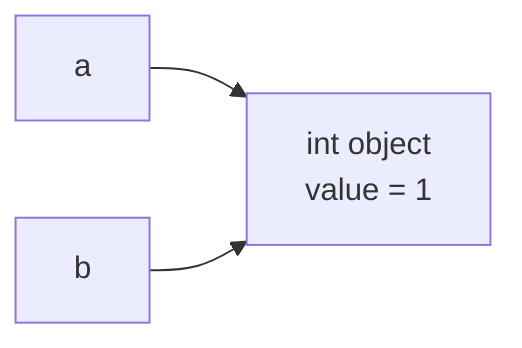

---
tags:
  - python
  - basics
---

# Variables and Types

> **This is a template article.** Copy this file to start a new one — it shows
> the front matter, a diagram, a code block, and a callout that you can reuse.

In Python a variable is a *name* bound to an *object*. The object carries the
type and value; the name is just a label pointing at it.

## How names and objects relate



Above, `a = 1` then `b = a` makes both names point at the *same* object — which
is why identity checks matter:

```python
a = 1
b = a
print(a is b)   # True — same object
print(id(a) == id(b))  # True
```

## Built-in types at a glance

| Category   | Types                                   | Mutable? |
| ---------- | --------------------------------------- | -------- |
| Numeric    | `int`, `float`, `complex`               | No       |
| Text       | `str`                                   | No       |
| Sequence   | `list`, `tuple`, `range`                | list yes |
| Mapping    | `dict`                                  | Yes      |
| Set        | `set`, `frozenset`                      | set yes  |

!!! warning "Mutable default arguments"
    Never use a mutable object as a default argument — it is created **once**
    and shared across calls:

    ```python
    def append(x, items=[]):   # bug: items persists between calls
        items.append(x)
        return items
    ```

    Use `items=None` and create the list inside the function instead.

??? note "Going deeper (collapsible)"
    Everything in Python is an object, including functions and classes. The
    `type()` of an object is itself an object whose type is `type`.
